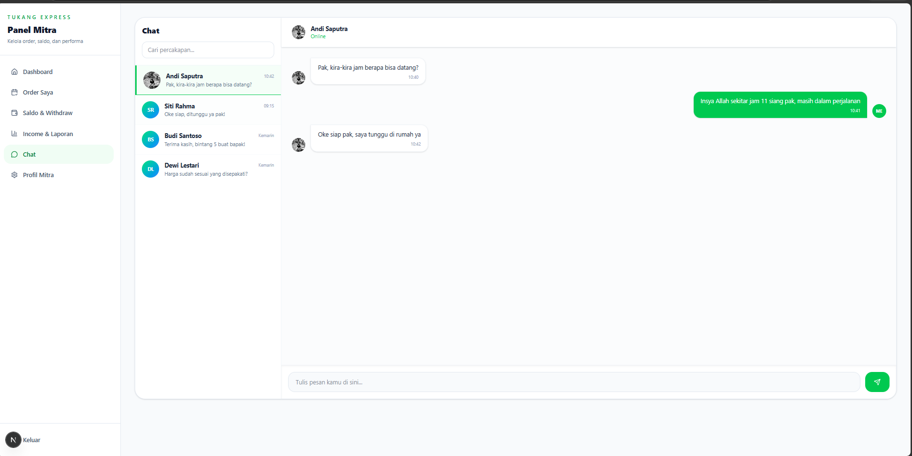

# Tukang Express 🔧

Tukang Express adalah platform on-demand penyedia jasa kebutuhan rumah terpercaya di Indonesia (Servis AC, Ledeng & Pipa, Kebersihan, Instalasi Listrik). Dilengkapi verifikasi KYC mitra, sistem pembayaran escrow (rekening bersama) aman, chat interaktif, dan panel administrasi internal.



---

## 🚀 Tech Stack

- **Framework**: [Next.js 16.2 (App Router)](https://nextjs.org/)
- **Runtime**: Node.js (Web Crypto API compliant)
- **Styling**: [Tailwind CSS v4](https://tailwindcss.com/)
- **Animations**: [GSAP (GreenSock)](https://gsap.com/) & [Three.js (React Three Fiber & Drei)](https://r3f.docs.pmnd.rs/) untuk interaksi 3D Canvas di Landing Page
- **Database / Auth**: [Supabase](https://supabase.com/) (SDK Admin / Anon Key ready)
- **Validation**: [Zod](https://zod.dev/) untuk ketatnya input schema di client & server-side API

---

## 📂 Struktur Folder Project

Struktur route Next.js (App Router) menggunakan konvensi Route Groups `(public)` dan `(dashboard)` untuk memisahkan layout publik dan halaman dashboard terproteksi:

```
src/
├── app/
│   ├── layout.tsx                      # Root layout (LiveMitraNotif global)
│   ├── globals.css                     # Tailwind v4 configuration & custom styles
│   ├── opengraph-image.tsx             # Dynamic metadata OpenGraph image
│   ├── sitemap.ts                      # Dynamic sitemap.xml generator
│   │
│   ├── (public)/                       # Route Group: Public (Navbar, Footer, Mobile bottom bar)
│   │   ├── layout.tsx
│   │   ├── page.tsx                    # Landing Page utama
│   │   ├── masuk/page.tsx              # Login via HP/OTP & Google Sign-In Simulator
│   │   ├── daftar-mitra/page.tsx       # Form registrasi KYC Mitra
│   │   ├── layanan/page.tsx            # Detail & list layanan
│   │   ├── cara-kerja/page.tsx         # Edukasi cara kerja & escrow
│   │   └── ...                         # Halaman informasi (Syarat, Privasi, Tentang, Kontak, Blog)
│   │
│   ├── (dashboard)/                    # Route Group: Dashboard (Tanpa navbar publik, layout minimal)
│   │   ├── layout.tsx
│   │   ├── customer/dashboard/
│   │   │   ├── layout.tsx              # Customer Dashboard Shell
│   │   │   ├── page.tsx                # Dashboard Index (stats & greeting)
│   │   │   ├── cari-mitra/page.tsx     # Cari mitra terdekat, chat, order
│   │   │   ├── order/page.tsx          # Pembuatan order baru & Escrow QRIS Simulator
│   │   │   ├── pembayaran/page.tsx     # Riwayat pembayaran & QRIS Modal Simulator
│   │   │   ├── chat/page.tsx           # Chat room customer dengan auto-reply bot
│   │   │   ├── profil/page.tsx         # Profil customer (menyimpan data ke localStorage)
│   │   │   └── riwayat/page.tsx        # Riwayat pesanan & pemberian rating mitra
│   │   │
│   │   └── mitra/dashboard/
│   │       ├── layout.tsx              # Mitra Dashboard Shell
│   │       ├── page.tsx                # Panel utama status online & performa
│   │       ├── orders/page.tsx         # Pengelolaan status order masuk (terima, selesai)
│   │       ├── saldo/page.tsx          # Panel saldo & pengajuan withdraw (API withdraw)
│   │       ├── income/page.tsx         # Grafik laporan pendapatan mingguan
│   │       ├── chat/page.tsx           # Chat room mitra dengan auto-reply bot
│   │       └── profil/page.tsx         # Edit profile & upload foto profil (persisten via localStorage)
│   │
│   └── api/                            # API Routes (Server-side validation & rate-limiting)
│       ├── auth/
│       │   ├── login/route.ts          # Request OTP untuk login tester/user
│       │   ├── verify-otp/route.ts     # Verifikasi OTP & set HTTP-only cookie session
│       │   └── logout/route.ts         # Clear session cookie
│       ├── mitra/
│       │   └── withdraw/route.ts       # Pengajuan withdraw saldo mitra
│       ├── admin/
│       │   └── withdrawals/            # Approve / reject request withdraw (hanya Admin)
│       ├── orders/
│       │   └── create/route.ts         # Pembuatan transaksi order baru
│       └── payments/
│           └── webhook/route.ts        # Payment webhook handler dari Midtrans
│
├── components/                         # Reusable UI & 3D Components
│   ├── 3d/                             # Three.js (R3F Canvas, floating tools & particles)
│   ├── dashboard/                      # Navigation Shells (Admin, Customer, Mitra)
│   └── ui/                             # Global sections & layout components
│
└── lib/                                # Utility libraries
    ├── session.ts                      # Cryptographic secure cookie session management
    ├── rate-limit.ts                   # In-memory IP rate limiter untuk proteksi DoS
    ├── otp-store.ts                    # In-memory OTP transaction store
    ├── withdraw-store.ts               # In-memory store untuk request withdraw admin
    └── validators.ts                   # Schema Zod untuk validasi input request
```

---

## 🔒 Security Hardening & Perlindungan Duplikasi

Untuk mengamankan web ini dari critical state dan mencegah duplikasi tidak sah, sistem telah dilengkapi pengamanan berlapis:

1. **Anti-Tampering Session (HMAC signed cookies)**
   Sesi login disimpan dalam cookie HTTP-only (`te_session`) yang ditandatangani secara kriptografis menggunakan algoritma `HMAC-SHA256` di Server. Jika data sesi dicoba dimodifikasi oleh client, tanda tangan HMAC akan pecah dan otomatis ditolak di tingkat Middleware.
2. **Ketat Middleware Route Guard**
   Setiap dashboard route (`/mitra/dashboard`, `/customer/dashboard`, `/admin`) diproteksi penuh oleh Middleware Next.js secara asinkron. Akses tanpa otorisasi akan otomatis di-redirect kembali ke halaman login.
3. **Zod Server-Side Validation**
   Semua API endpoint memvalidasi payload JSON secara ketat sebelum dieksekusi. Mencegah buffer overflow, parameter injection, dan eksploitasi data.
4. **Rate Limiting & Anti-Bruteforce**
   Endpoint krusial (login, verifikasi OTP, pembuatan order, pengajuan withdraw) diproteksi in-memory Rate Limiter per client IP untuk mencegah serangan Denial of Service (DoS) dan brute-force.
5. **Midtrans Webhook Signature Verification**
   Webhook Midtrans diamankan dengan signature key (HMAC SHA512) rahasia yang dicocokkan di server untuk mencegah transaksi fiktif/manipulatif dari pihak luar.
6. **Security Headers & CSP (Content Security Policy)**
   Konfigurasi `next.config.ts` memuat header CSP ketat (`frame-ancestors 'none'`, `X-Frame-Options: SAMEORIGIN`, `X-Content-Type-Options: nosniff`) untuk melindungi dari clickjacking, mime-type sniffing, dan cross-site scripting (XSS).

---

## 🛠️ Cara Pemakaian & Tester Account

Untuk mencoba simulasi lengkap platform secara instan tanpa perlu menyiapkan server SMS/Database terlebih dahulu, gunakan salah satu akun tester di bawah pada halaman `/masuk`:

### Akun Tester

| Role | Nomor HP | Kode OTP | Keterangan |
|---|---|---|---|
| **Customer** | `08111111111` | `123456` | Mencari mitra, buat order, simulasi bayar QRIS, chat mitra. |
| **Mitra** | `08222222222` | `123456` | Terima order, ubah status, withdraw, ganti foto profil. |
| **Admin** | `08000000000` | `123456` | Menyetujui/menolak penarikan saldo (withdraw) mitra. |

> **Google Sign-In Simulator**: Anda juga bisa mengklik tombol **"Masuk dengan Google"** di halaman login untuk memilih akun tester di atas secara instan.

### Flow Simulasi Transaksi & Escrow:
1. Masuk sebagai **Customer** (`08111111111`) atau via Google Sign-In.
2. Cari mitra di halaman **Cari Mitra** lalu klik **Pesan**.
3. Isi detail alamat, pilih metode pembayaran **QRIS**, lalu buat order.
4. Klik **Simulasi Bayar** pada pop-up QRIS dummy. Status escrow order otomatis menjadi `HELD` (Dana aman ditahan oleh platform).
5. Logout lalu masuk sebagai **Mitra** (`08222222222`).
6. Di menu **Order Saya**, klik **Terima Order** lalu **Tandai Selesai**.
7. Masuk kembali sebagai **Customer** untuk mengkonfirmasi bahwa pengerjaan telah rampung dan berikan penilaian bintang (rating). Ulasan rating Anda akan otomatis ter-update secara real-time di halaman cari mitra.
8. Masuk kembali sebagai **Mitra** untuk menarik pendapatan Anda via menu **Saldo & Withdraw**.
9. Masuk sebagai **Admin** (`08000000000`) untuk menyetujui / approve pengajuan withdraw tersebut secara instan.

---

## 💻 Development & Deployment

### 1. Inisialisasi Project
Salin file `.env.example` menjadi `.env.local` untuk mengatur variabel lingkungan lokal Anda:
```bash
cp .env.example .env.local
```
Lalu jalankan install dependencies dan server dev:
```bash
npm install
npm run dev
```

### 2. Build Production
Sebelum dideploy, pastikan project lolos verifikasi TypeScript & ESLint:
```bash
npm run build
```

---
Untuk feedback atau kontribusi, silakan laporkan isu pada repositori ini.
