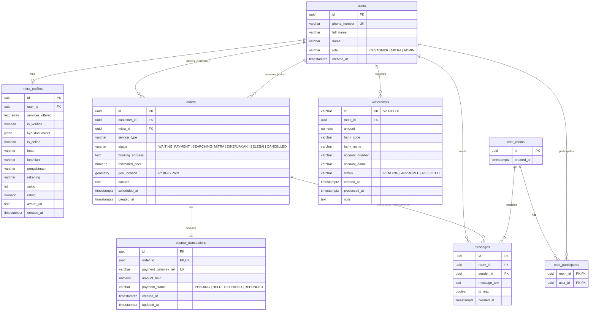

# Setup Database & Entity Relationship Diagram (ERD) — Supabase

Dokumen ini berisi panduan setup database **Supabase PostgreSQL** dan rancangan **Entity Relationship Diagram (ERD)** untuk menghubungkan database ke aplikasi **Tukang Express**.

---

## 📊 Entity Relationship Diagram (ERD)

Berikut adalah relasi antar tabel pada platform Tukang Express digambarkan dalam diagram Mermaid:



---

## 🛠️ SQL Schema DDL (Supabase SQL Editor)

Salin kode SQL di bawah ini lalu jalankan di **SQL Editor** pada Dashboard Supabase Anda:

```sql
-- 1. Enable PostGIS Extension untuk pencarian lokasi geografis/maps
CREATE EXTENSION IF NOT EXISTS postgis;

-- 2. Buat tabel Users
CREATE TABLE IF NOT EXISTS public.users (
    id UUID PRIMARY KEY DEFAULT gen_random_uuid(),
    phone_number VARCHAR(20) UNIQUE NOT NULL,
    full_name VARCHAR(100),
    nama VARCHAR(100), -- fallback / alias
    role VARCHAR(20) NOT NULL CHECK (role IN ('CUSTOMER', 'MITRA', 'ADMIN')),
    created_at TIMESTAMPTZ DEFAULT NOW()
);

-- 3. Buat tabel Mitra Profiles
CREATE TABLE IF NOT EXISTS public.mitra_profiles (
    id UUID PRIMARY KEY DEFAULT gen_random_uuid(),
    user_id UUID NOT NULL REFERENCES public.users(id) ON DELETE CASCADE UNIQUE,
    services_offered TEXT[] NOT NULL DEFAULT '{}',
    is_verified BOOLEAN NOT NULL DEFAULT false,
    kyc_documents JSONB NOT NULL DEFAULT '{}'::jsonb,
    is_online BOOLEAN NOT NULL DEFAULT false,
    kota VARCHAR(100),
    keahlian VARCHAR(50),
    pengalaman VARCHAR(100),
    rekening VARCHAR(50),
    saldo INT NOT NULL DEFAULT 0 CHECK (saldo >= 0),
    rating NUMERIC(3,2) DEFAULT 0.00 CHECK (rating >= 0 AND rating <= 5),
    avatar_url TEXT,
    created_at TIMESTAMPTZ DEFAULT NOW()
);

-- 4. Buat tabel Orders (Menggunakan PostGIS Geometry)
CREATE TABLE IF NOT EXISTS public.orders (
    id UUID PRIMARY KEY DEFAULT gen_random_uuid(),
    customer_id UUID REFERENCES public.users(id) ON DELETE SET NULL,
    mitra_id UUID REFERENCES public.users(id) ON DELETE SET NULL,
    service_type VARCHAR(50) NOT NULL CHECK (service_type IN ('ac', 'ledeng', 'kebersihan', 'listrik', 'lainnya')),
    status VARCHAR(30) NOT NULL DEFAULT 'WAITING_PAYMENT' 
        CHECK (status IN ('WAITING_PAYMENT', 'SEARCHING_MITRA', 'DIKERJAKAN', 'SELESAI', 'CANCELLED', 'DIBATALKAN')),
    booking_address TEXT NOT NULL,
    estimated_price NUMERIC(12,2) NOT NULL CHECK (estimated_price > 0),
    geo_location GEOMETRY(Point, 4326),
    catatan TEXT,
    scheduled_at TIMESTAMPTZ,
    created_at TIMESTAMPTZ DEFAULT NOW()
);

-- 5. Buat tabel Escrow Transactions
CREATE TABLE IF NOT EXISTS public.escrow_transactions (
    id UUID PRIMARY KEY DEFAULT gen_random_uuid(),
    order_id UUID NOT NULL REFERENCES public.orders(id) ON DELETE CASCADE UNIQUE,
    payment_gateway_ref VARCHAR(100) UNIQUE,
    amount_held NUMERIC(12,2) NOT NULL CHECK (amount_held > 0),
    payment_status VARCHAR(30) NOT NULL DEFAULT 'PENDING'
        CHECK (payment_status IN ('PENDING', 'HELD', 'RELEASED', 'REFUNDED')),
    created_at TIMESTAMPTZ DEFAULT NOW(),
    updated_at TIMESTAMPTZ DEFAULT NOW()
);

-- 6. Buat tabel Withdrawals
CREATE TABLE IF NOT EXISTS public.withdrawals (
    id VARCHAR(50) PRIMARY KEY, -- ex: WD-1719564612
    mitra_id UUID NOT NULL REFERENCES public.users(id) ON DELETE CASCADE,
    amount NUMERIC(12,2) NOT NULL CHECK (amount >= 100000),
    bank_code VARCHAR(20) NOT NULL,
    bank_name VARCHAR(100) NOT NULL,
    account_number VARCHAR(30) NOT NULL,
    account_name VARCHAR(100) NOT NULL,
    status VARCHAR(20) NOT NULL DEFAULT 'PENDING' CHECK (status IN ('PENDING', 'APPROVED', 'REJECTED')),
    created_at TIMESTAMPTZ DEFAULT NOW(),
    processed_at TIMESTAMPTZ,
    note TEXT
);

-- 7. Buat tabel Chat & Messages
CREATE TABLE IF NOT EXISTS public.chat_rooms (
    id UUID PRIMARY KEY DEFAULT gen_random_uuid(),
    created_at TIMESTAMPTZ DEFAULT NOW()
);

CREATE TABLE IF NOT EXISTS public.chat_participants (
    room_id UUID NOT NULL REFERENCES public.chat_rooms(id) ON DELETE CASCADE,
    user_id UUID NOT NULL REFERENCES public.users(id) ON DELETE CASCADE,
    PRIMARY KEY (room_id, user_id)
);

CREATE TABLE IF NOT EXISTS public.messages (
    id UUID PRIMARY KEY DEFAULT gen_random_uuid(),
    room_id UUID NOT NULL REFERENCES public.chat_rooms(id) ON DELETE CASCADE,
    sender_id UUID REFERENCES public.users(id) ON DELETE SET NULL,
    message_text TEXT NOT NULL,
    is_read BOOLEAN NOT NULL DEFAULT false,
    created_at TIMESTAMPTZ DEFAULT NOW()
);

-- 8. Indeks Kinerja Database
CREATE INDEX IF NOT EXISTS idx_users_phone ON public.users(phone_number);
CREATE INDEX IF NOT EXISTS idx_mitra_online ON public.mitra_profiles(is_online) WHERE is_online = true;
CREATE INDEX IF NOT EXISTS idx_orders_customer ON public.orders(customer_id);
CREATE INDEX IF NOT EXISTS idx_orders_mitra ON public.orders(mitra_id);
CREATE INDEX IF NOT EXISTS idx_orders_status ON public.orders(status);
CREATE INDEX IF NOT EXISTS idx_messages_room ON public.messages(room_id);
CREATE INDEX IF NOT EXISTS idx_escrow_order ON public.escrow_transactions(order_id);
```

---

## 🔐 Keamanan: Row Level Security (RLS)

Untuk mengamankan database, aktifkan **RLS (Row Level Security)** agar user tidak bisa saling melihat data order / profile milik orang lain secara sembarangan:

```sql
-- Aktifkan RLS
ALTER TABLE public.users ENABLE ROW LEVEL SECURITY;
ALTER TABLE public.mitra_profiles ENABLE ROW LEVEL SECURITY;
ALTER TABLE public.orders ENABLE ROW LEVEL SECURITY;
ALTER TABLE public.escrow_transactions ENABLE ROW LEVEL SECURITY;
ALTER TABLE public.withdrawals ENABLE ROW LEVEL SECURITY;
ALTER TABLE public.messages ENABLE ROW LEVEL SECURITY;

-- Policy 1: Users bisa membaca datanya sendiri
CREATE POLICY "Users can read own data" ON public.users
    FOR SELECT USING (auth.uid() = id);

-- Policy 2: Mitra bisa dibaca secara publik oleh customer yang ingin order
CREATE POLICY "Public profile viewing" ON public.mitra_profiles
    FOR SELECT USING (true);

-- Policy 3: Edit profile hanya bisa dilakukan oleh pemiliknya
CREATE POLICY "Users can update own profile" ON public.mitra_profiles
    FOR UPDATE USING (auth.uid() = user_id);

-- Policy 4: Customer atau Mitra yang bersangkutan bisa melihat datanya di orders
CREATE POLICY "Users can view related orders" ON public.orders
    FOR SELECT USING (auth.uid() = customer_id OR auth.uid() = mitra_id);

-- Policy 5: Hanya Customer pembuat order yang bisa melakukan insert order
CREATE POLICY "Customer can create orders" ON public.orders
    FOR INSERT WITH CHECK (auth.uid() = customer_id);
```

---

## ⚡ Langkah Integrasi ke Project

### Langkah 1: Atur Environment Variables
Ubah isi file `.env.local` Anda dengan credentials dari database Supabase Anda:
```env
NEXT_PUBLIC_SUPABASE_URL=https://your-project-id.supabase.co
NEXT_PUBLIC_SUPABASE_ANON_KEY=eyJhbGciOiJIUzI1NiIsInR5cCI6IkpXVCJ9...
SUPABASE_SERVICE_ROLE_KEY=eyJhbGciOiJIUzI1NiIsInR5cCI6IkpXVCJ9...
```

### Langkah 2: Menggunakan Client SDK
Kode untuk melakukan *query* sudah siap digunakan via helper `createSupabaseAdmin()` atau `createSupabaseAnon()` di file [supabase.ts](file:///c:/Users/sante/Downloads/Tukang-Express/tukang-express/src/lib/supabase.ts).

Contoh pemanggilan di Server Component / Route Handler:
```typescript
import { createSupabaseAdmin } from '@/lib/supabase';

const supabase = createSupabaseAdmin();
const { data: users, error } = await supabase
  .from('users')
  .select('*')
  .eq('role', 'MITRA');
```
